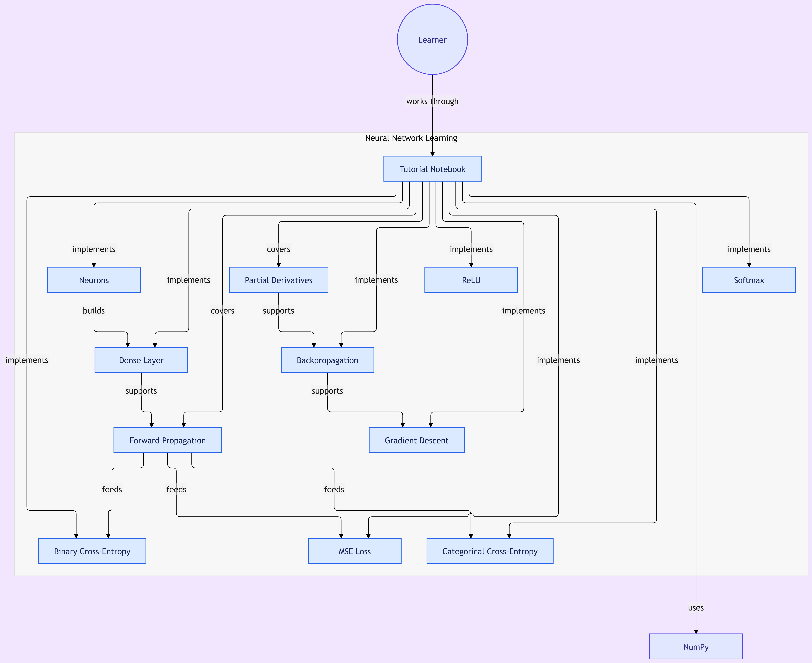

# Neural Networks From Scratch

A hands-on implementation of the fundamental building blocks of neural networks using **Python** and **NumPy**, without relying on deep learning frameworks such as TensorFlow or PyTorch.

This project focuses on understanding the mathematical foundations of neural networks by implementing each component step by step, from neurons and dense layers to forward propagation, loss functions, backpropagation, and gradient descent.

## Objectives

- Understand how neural networks work internally.
- Implement core neural network components from scratch.
- Learn the mathematics behind forward and backward propagation.
- Build intuition before using deep learning frameworks.

---
## Learning Roadmap

This diagram maps the concepts covered in the tutorial, including
neurons, dense layers, activation functions, loss functions,
backpropagation, and gradient descent.

[View full-size diagram](learning-roadmap.png)

---
## Topics Covered

- Single Neuron
- Multiple Neurons
- Dense (Fully Connected) Layer
- ReLU Activation Function
- Softmax Activation Function
- Forward Propagation
- Mean Squared Error (MSE)
- Binary Cross-Entropy (BCE)
- Categorical Cross-Entropy Loss
- Partial Derivatives
- Backpropagation
- Gradient Descent
---
## Technologies Used

- Python
- NumPy
- Matplotlib
- Jupyter Notebook
---
## Learning Outcomes

Through this project, I gained practical experience in:

- Building neural network components from scratch.
- Understanding matrix operations used in deep learning.
- Implementing activation and loss functions.
- Computing gradients using backpropagation.
- Updating model parameters using gradient descent.
---
## Future Improvements

- Implement Mini-Batch Gradient Descent
- Add Momentum and Adam Optimizers
- Support Multiple Hidden Layers
- Build a Complete Feedforward Neural Network
- Compare the implementation with TensorFlow and PyTorch
---
## References

- *Neural Networks from Scratch* by Harrison Kinsley & Daniel Kukieła
- NumPy Documentation
- Deep Learning by Ian Goodfellow, Yoshua Bengio, and Aaron Courville

---

⭐ If you found this project helpful, feel free to star the repository.
